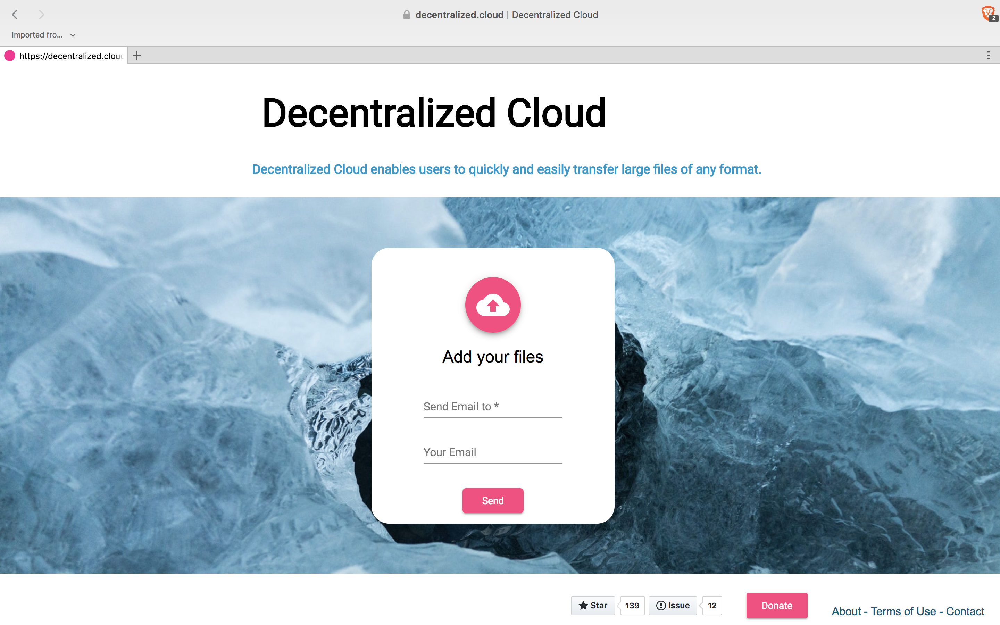
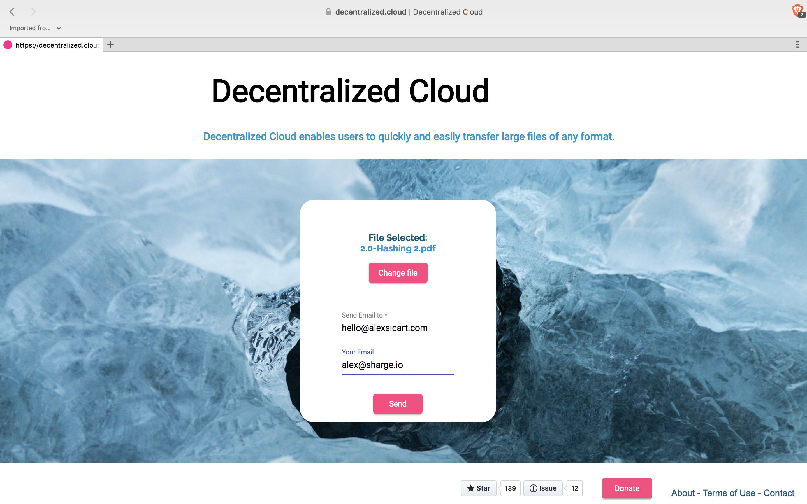
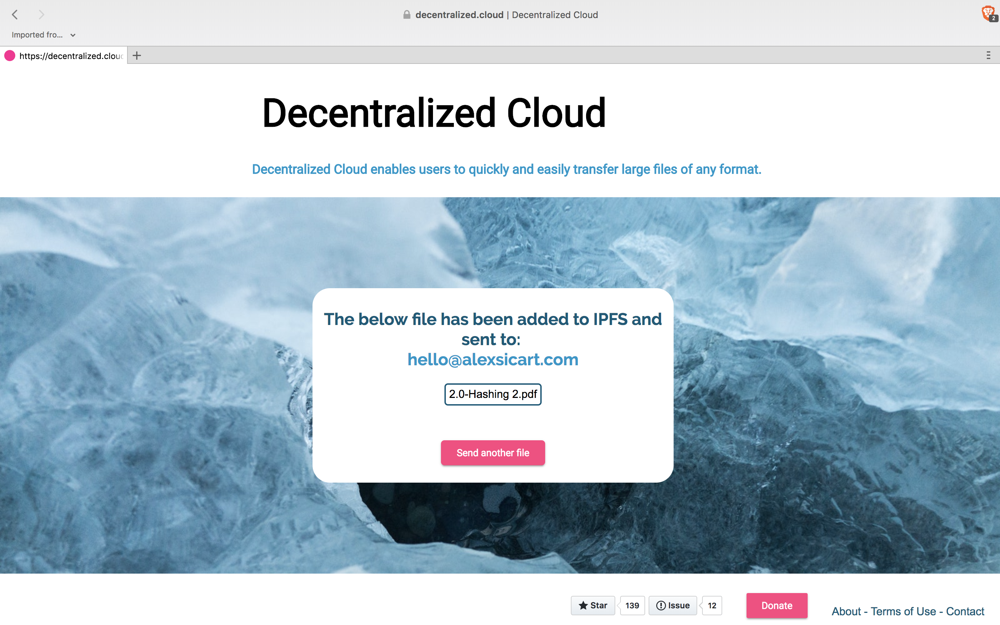

# Decentralized-Cloud

## Description
Decentralized Cloud is the simplest way to send your files around the world using the InterPlanetary File System.

IPFS (the InterPlanetary File System) is a new hypermedia distribution protocol, addressed by content and identities. IPFS enables the creation of completely distributed applications. It aims to make the web faster, safer, and more open.

## How it works

Decentralized-Cloud is a work in progress!

Download the modules:

      npm i
Start the App on the browser:

      npm start

Run production mode:

    npm run build --prod

## Tech Stack

**Main Framework**: [Angular](https://angular.io/)

**Libraries**: [IPFS](https://ipfs.io/)

**Server**: Private (Koa)

## Contributors

We love pull requests from everyone. By participating in this project, you agree to abide by the thoughtbot
[code of conduct](https://thoughtbot.com/open-source-code-of-conduct)

Fork, then clone the repo:
Push to your fork and  [submit a pull request](https://github.com/alexsicart/Decentralized-Cloud/pull/new/gh-pages).
